# State-Locked Protocol (SLP) Reference Implementation
### Hardware-Gated "Proof of Physical Work" for DePIN & 6G Ambient IoT

[](https://www.uplinklogic.tech)
[](https://www.3gpp.org)
[]()

## ⚡ The Energy-Security Trilemma
The Autonomous Economy (Drones, Sensors, DePIN) faces a critical bottleneck: **The "Always-On" Penalty.**

To remain verifiable on a network, devices today must maintain an active radio connection (MQTT/Keep-Alive). This results in:
* **Vampire Drain:** 40-60% of battery life is lost to standby background polling[6].
* **Sybil Vulnerability:** Software-based sleep modes can be spoofed, allowing "Ghost Nodes" to fake location data[60].
* **Cyber Fragility:** An "Always-On" device is an open target for Denial-of-Sleep (DoS) battery exhaustion attacks.

## 🛡️ The Solution: State-Locked Dormancy
**Greetme Technologies** introduces the **State-Locked Protocol (SLP)**—a hardware-rooted logic gate that physically disconnects the device CPU from power and memory allocation until a verified physical event occurs.

Unlike standard sleep modes (which leak ~3µW), SLP reduces consumption to the leakage floor of the transistor gates (<100nA) while maintaining cryptographic security[61, 108].

### Architecture Overview

```mermaid
%%{init: {'theme': 'neutral', 'themeVariables': { 'fontSize': '16px', 'fontFamily': 'arial'}}}%%
graph TD
    subgraph Standard_Architecture ["🔴 The Problem: Standard 3GPP DRX"]
        direction TB
        A1[CPU: IDLE / SLEEP] -->|Retention Current ~3µW| B1(RAM: RETENTION)
        B1 -->|Clock Cycles| C1(Radio: DRX MONITOR)
        C1 -->|Continuous 'Vampire Drain'| D1[(BATTERY)]
        style D1 fill:#ffcccc,stroke:#333,stroke-width:2px
        style C1 fill:#ffe6e6,stroke:#cc0000,stroke-dasharray: 5 5
    end

    subgraph State_Locked_Architecture ["🟢 The Solution: State-Locked Protocol (SLP)"]
        direction TB
        A2[CPU: OFF / 0V] --- B2[RAM: OFF / 0V]
        B2 --- C2[Radio: OFF / 0V]
        
        G2{{Hardware Gate Logic}} -->|Leakage <100nA| D1
        
        Trigger((Physical Event)) -->|Interrupt| G2
        G2 -->|1. Validate| H2[Monotonic Counter ++]
        H2 -->|2. Wake Signal| I2{Boot Sequence}
        I2 -->|3. Sign Payload| J2[Generate Sig: ID + Counter]
        J2 -->|4. Transmit| K2([Encrypted Burst])
        
        style G2 fill:#e6fffa,stroke:#00cc99,stroke-width:2px
        style K2 fill:#ccffeb,stroke:#00cc99,stroke-width:2px
        style Trigger fill:#fff,stroke:#333,stroke-width:2px,stroke-dasharray: 5 5
    end

    classDef default fill:#fff,stroke:#333,stroke-width:1px;
```



## 🔐 Core Innovation: The "Physical Nonce"
The SLP replaces software timestamps with a Hardware Monotonic Counter. This counter is fused to the silicon die and can only increment upon a verified hardware interrupt (e.g., GPS movement, tactile trigger, or specific sensor threshold).

*   **Zero-Allocation Dormancy:** The device does not exist on the network map until it moves.
*   **Anti-Replay Assurance:** Because the counter is hardware-locked, a hacker cannot "rewind" the state to replay old location data. The blockchain rejects any payload where New_Counter <= Last_Recorded_Counter.
*   **Air-Gapped Security:** A hacker cannot "spam" a device that is physically disconnected from the Wake-Up Controller.

## 📂 Repository Structure
This reference implementation demonstrates the SLP verification flow for Solana/DePIN networks.

*   `/include`: Public Header Files (`slp_core.h`) - The main API definition.
*   `/src`: C++ SDK & TEE Emulator - The core logic (`slp_manager.cpp`) and hardware stub (`tee_stub.cpp`).
*   `/examples`: Demo Application (`demo_app.cpp`) - A sample implementation showing how to generate proofs.
*   `/contracts` (Concept): SLPVerifier.sol - The on-chain "Bouncer" that validates hardware signatures.
*   `/simulation` (Concept): slp_sim.py - Python-based hardware emulator.

## 🔧 SDK Installation & Usage

### Android (Gradle)
```gradle
dependencies {
    implementation 'tech.uplinklogic:slp-sdk:0.1.0-alpha'
}
```

### iOS (CocoaPods)
```ruby
pod 'SLP-Core', '~> 0.1.0'
```

### Usage Example (C++)
Generating a "Proof of Physical Work" token:

```cpp
#include "slp_core.h"

// 1. Initialize the Secure Context (Binds to TEE)
SLP::Context secure_ctx = SLP::Context::Initialize();

// 2. Define the Trigger (e.g., GPS Location Lock)
SLP::Trigger physical_trigger = {
    .type = SLP_TRIGGER_GPS_LOCK,
    .precision = SLP_PRECISION_HIGH
};

// 3. Generate the State-Locked Token
try {
    std::string token = secure_ctx.GenerateToken(physical_trigger);
    Network::SendPayload(token, data);
} catch (SLP::HardwareException& e) {
    Log::Error("Hardware integrity check failed.");
}
```

## 🚀 Use Cases
*   **Drone Logistics:** Compliant "Intermittent Broadcasting" for Remote ID (UK/EU) that reclaims 15% flight range.
*   **DePIN Infrastructure:** Preventing "GPS Spoofing" in drive-to-earn and mapping networks (Hivemapper, Helium).
*   **Critical IoT:** Protecting high-value assets from battery exhaustion attacks (EU Cyber Resilience Act).

## 📜 Standards & Licensing
*   **Patent Status:** Patent Pending (GB Application: GB2602651.8).
*   **Standardization:** This architecture is currently being proposed as a "D1T1" topology candidate for 3GPP Release 20 (Ambient IoT).
*   **Licensing:** This repository is a Reference Implementation. Commercial use of the State-Locked Protocol logic requires a license from Greetme Technologies LTD.

**Maintained by:** Greetme Technologies LTD | London, United Kingdom
